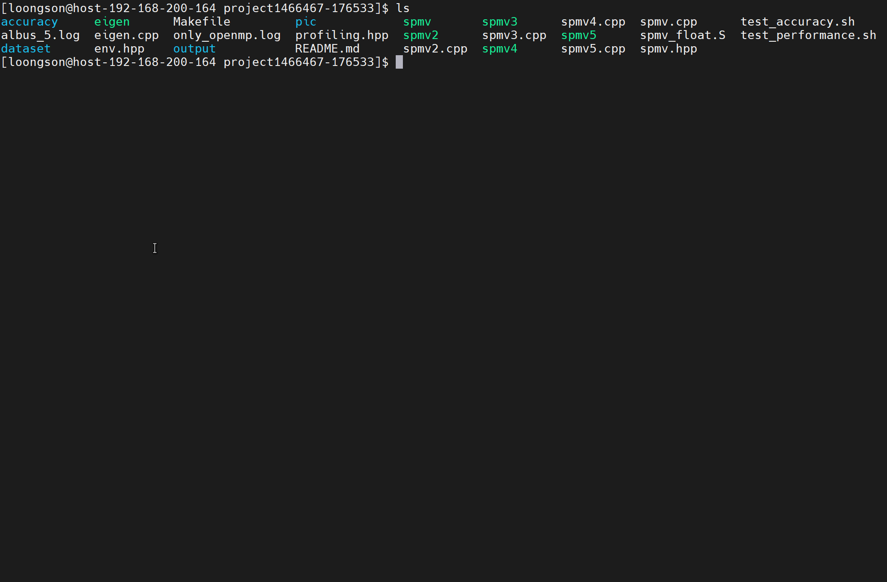
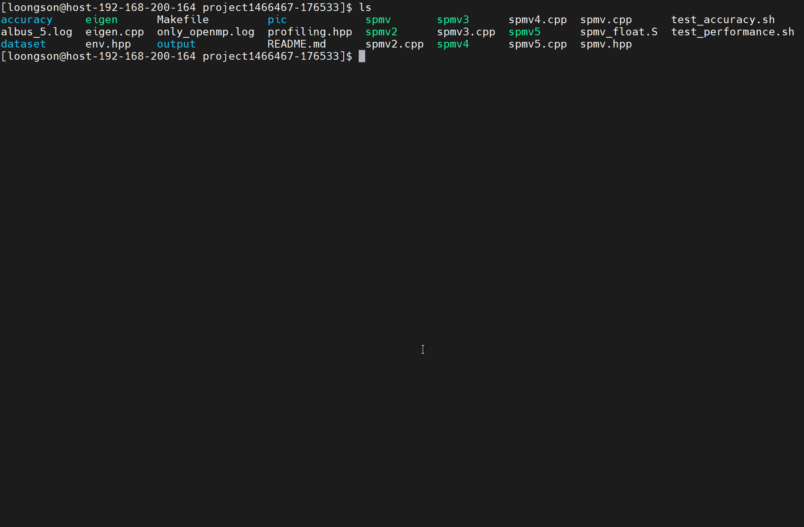
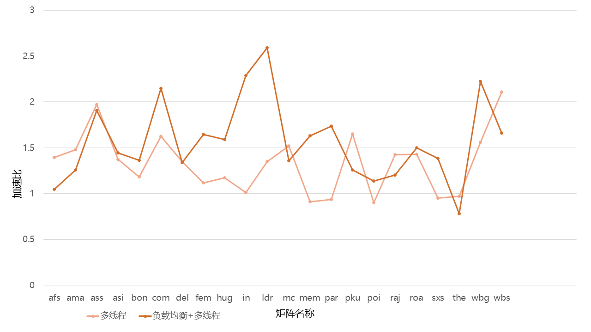
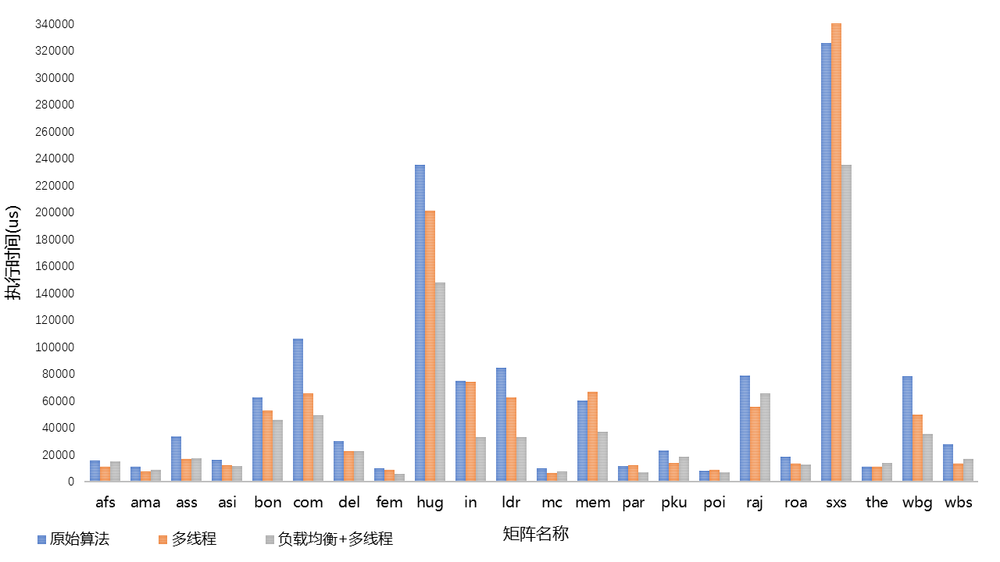

# proj220技术文档
* 赛题：基于龙芯3A5000设计实现一个高效的SPMV（稀疏矩阵乘向量）
* 队名：勇敢向前冲
* 成员：秦寒冰 周浩杰
* 学校：北京大学

[[_TOC_]]

## 目标描述
针对LoongArch架构，使用多线程，矩阵分块和SIMD等技术，优化实现CSR/CSC格式SPMV（稀疏矩阵乘向量）。
具体内容包括：
1. 调研已有的SPMV算法优化技术 
2. 实现基于龙芯3A5000的算法优化，进行测试和调优，生成相应文档。

## CSR格式的SPMV介绍


CSR(Compressed Sparse Row)格式是存储稀疏矩阵的常用数据结构，如上图所示。相同行的元素用同一种颜色表示，矩阵`A`的元素值按序依次排列在`val`数组中，每个元素对应的列索引按同样的顺序存储在`ind` 数组中。`ptr`数组大小是行数加一，数组第一个元素存储的是矩阵第一行之前（不包括第一行）所有非零元素的总数，也就是0，数组第二个元素存储的是矩阵第二行之前（不包括第二行）所有非零元素的总数，以此类推。

基于CSR格式的常规SPMV算法实现如下伪代码所示
```
// y <- A*x, where A is in CSR.
for (i = 0; i < m; ++i) {
  for (k = ptr[i]; k < ptr[i+1]; ++k)
  y0 += val[k] * x[ind[k]];
  y[i] = y0;
}
```

这种实现中`x`的值是间接访问的，因而其空间局部性较差。

## 仓库文件简介
* **Accuracy/**: 该文件夹保存测试SPMV计算准确性的数据文件，前缀是`matrix`的文件存储的是稀疏矩阵，其格式为：第一行记录的是矩阵行数，矩阵列数，非零元素个数。接下来的每一行记录的是元素的行索引，元素的列索引，元素值。矩阵的行列索引都从0开始。 
* **eigen.cpp**: 使用线性代数计算库`Eigen`进行稀疏矩阵运算，作为标准的计算结果来验证自己开发的算子的正确性。
* **env.hpp**: 用于支持程序使用环境变量控制需要的逻辑，比如根据环境变量选择是否要程序打印调试信息。这有助于我们调试代码。
* **profiling.hpp**: 用于支持查看程序中某段代码的耗时，这有助于我们分析、优化程序性能。
* **spmv.hpp**: 支持CSR格式的稀疏矩阵向量乘运算
* **spmv.cpp**: 使用常规的基于CSR格式的SPMV运算
* **spmv2.cpp**: 使用了SIMD指令的SPMV运算
* **spmv3.cpp**: 无人工处理对稀疏矩阵乘进行多线程加速的SPMV运算
* **spmv4.cpp**: 使用了负载均衡的SPMV运算
* **spmv5.cpp**: 使用了负载均衡和SIMD的SPMV运算
* **spmv_float.S**: 使用龙芯架构的向量指令集开发的SPMV
* **test_accuracy.sh**: 该脚本功能是测试开发的程序是否计算正确
* **test_performace.sh**: 该脚本功能是评估算法相对原始的SPMV的加速比

## 测试框架介绍与使用
### 环境搭建
本项目的`eigen.cpp`使用了`Eigen`库，按照如下流程按照到计算机上，同时我们使用的机器架构为`loongarch64`。
```
wget https://gitlab.com/libeigen/eigen/-/archive/3.4.0/eigen-3.4.0.tar.gz # 下载源代码
tar -zxvf eigen-3.4.0.tar.gz #解压
cd eigen-3.4.0
mkdir build && cd build
cmake ..
sudo make install 
```

安装完成后，克隆本项目，进入主目录使用`make` 即可编译出所有的可执行程序。

### 评估正确性
`test_accuracy`脚本用来评估自己实现的算法的计算结果的准确性。设计思路是利用`Eigen`库计算得到的结果和自己实现的算法得到的结果作比较，如果相同则说明自己写的代码计算正确。用法为：
> bash test_accuracy.sh ${可执行程序路径}

例如为了验证原始的SPMV是否实现正确，运行此命令`bash test_accuracy.sh ./spmv`，如果计算正确，终端会打印通过信息，如果不通过，终端会打印第一次计算错误的输出向量的行索引，以及两个程序的输出结果。



### 评估性能
`test_performance`脚本使用了22个不同类型的稀疏矩阵用来评估程序相比常规的基于CSR格式的SPMV算法的加速比，记录算子运行的平均时间。用法为：
> bash test_performance.sh ${可执行程序路径} ${迭代次数}

例如，运行此命令`bash test_performance.sh ./spmv4 1`，脚本会执行1次spmv和spmv4这个程序，计算原始的spmv算法执行的平均时间，计算使用了负载均衡程序的spmv4的平均时间，计算spmv4相对于spmv的加速比。




#### 数据集介绍
我们从[ Sparse Suite Collection](https://sparse.tamu.edu/),选择了22个具有代表性的稀疏矩阵。Sparse Suite Collection收集了大量在实际场景应用广泛的稀疏矩阵。这些矩阵集广泛用于稀疏矩阵算法的开发和性能评估，因为人工生成的矩阵会对实验产生一些误导性。 `test_performance`脚本使用的数据集下载地址点击[这里](https://pan.baidu.com/s/1xqiqJ3GySV2QYSnj4xEhYA?pwd=c57w)。数据集中的稀疏矩阵特点见下表。括号中的内容是矩阵名字的简称，用于画性能比较图，方便作为横坐标。


| 矩阵名称 | 行 x 列 | 非零元素个数 | 稀疏度 |
| --- | --- | --- | --- |
| af_shell1(**afs**) | 504855 x 504855 | 9046868 | 3.55e-05 |
| amazon0601(**ama**) | 403394 x 403394 | 3387388 | 2.08e-05 |
| as-Skitter(**ass**) | 1696415 x 1696415 | 11095298 | 3.86e-06 |
| ASIC_680k(**asi**) | 682862 x 682862 | 3871773 | 8.303e-06 |
| boneS10(**bon**) | 914898 x 914898 | 55468422 | 6.63e-05 |
| com-Youtube(**com**) | 1134890 x 1134890 | 5975248 | 4.639e-06 |
| delaunay_n19(**del**) | 524288 x 524288 | 3145646 | 1.14e-05 |
| FEM_3D_thermal2(**fem**) | 147900 x 147900 | 3489300 | 1.59e-04 |
| hugetric-00020(**hug**) | 7122792 x 7122792 | 21361554 | 4.21e-07 |
| in-2004(**in**) | 1382908 x 1382908 | 16917053 | 8.846e-06 |
| ldoor(**ldr**) | 952203 x 952203 | 23737339 | 2.62e-05 |
| mc2depi(**mc**) | 525825 x 525825 | 2100225 | 7.59e-06 |
| memchip(**mem**) | 2707524 x 2707524 | 14810202 | 2.02e-06 |
| parabolic_fem(**par**) | 525825 x 525825 | 3674625 | 1.33e-05 |
| pkustk14(**pku**) | 151926 x 151926 | 14836504 | 6.428e-04 |
| poisson3Db(**poi**) | 85623 x 85623 | 2374949 | 3.24e-04 |
| rajat31(**raj**) | 4690002 x 4690002 | 20316253 | 9.24e-07 |
| roadNet-TX(**roa**) | 1393383 x 1393383 | 3843320 | 1.98e-06 |
| sx-stackoverflow(**sxs**) | 2601977 x 2601977 | 36233450 | 5.352e-06 |
| thermomech_dK(**the**) | 204316 x 204316 | 2846228 | 6.81e-05 |
| web-Google(**wbg**) | 916428 x 916428 | 5105039 | 6.08e-06 |
| webbase-1M(**wbs**) | 1000005 x 1000005 | 3105536 | 3.106e-06 |


## 效果展示
我们测试性能的环境是4线程的龙芯3C5000。如下图所示，该图横坐标表示算子的执行时间，横坐标是进行向量乘的稀疏矩阵名称。优化后的算法相比原始的spmv算法在大部分数据上都取得了1.5以上的加速比。只进行多线程加速，绝大部分矩阵都实现了加速，除了`memchip` 和 `sx-stackoverflow`执行时间比原始算法慢了。当对线程的处理原始进行负载均衡后，程序执行时间得到普遍得到显著减少。


下图是处理不同稀疏矩阵，负载均衡下的多线程算法、无处理的多线程算法相比于原始算法的加速比。图中纵坐标表示相较于原始SPMV算法的加速比，横坐标是进行向量乘的稀疏矩阵名称。无处理的多线程加速性能表现并不稳定，在`memchip`,`parabolic_fem`的稀疏矩阵的加速比甚至小于1。当负载均衡后，算法效果更好。


## 优化思路分析
### 访存效率瓶颈
稀疏矩阵是指矩阵中零值元素的个数远远多于非零元素个数，矩阵中的零值元素在参与向量乘法运算时不起作用，所以现有的稀疏矩阵存储格式大多只保存非零元素，并利用额外数组保存非零元素的位置信息，确保实现SPMV。
#### 内存访问频繁
具体计算时，每一个行中的非零元素都要与向量中对应位置的元素进行乘加操作，这需要进行大量**内存访问**操作。

CSR作为一种稀疏矩阵的存储结构，由3个数组构成：**值**(**values**)、**列索引**(**col_Index**)、**行索引**（**row_ptr**）。**values**数组表示稀疏矩阵**matrix**中的每一个非零元素，按照从左到右、从上到下的顺序存储非零元素，**col_ptr**数据表示每个非零元素在矩阵**matrix**中对应的列索引，**row_ptr**数组中第i个元素记录了前i-1行包含的非零元素的数量，比如**row_ptr[k]** 表示在行k之前，矩阵中所有元素的数目。

我们看下面基于CSR数据格式中SPMV串行循环实现，为进行一次乘加操作，我们需要通过内存访问获得参与计算的非零元素、该非零元素的列索引、以及向量中该索引对应的元素值，这需要3次内存访问的操作，且每次内存访问的地址都不连续，内存访问的时间远远超过CPU运算的时间，导致整体运算性能降低。基于CSR格式的SPMV是访存密集型的运算操作，其性能优化应当首先解决访存效率带来的瓶颈问题。在本项目中采用SIMD(单指令多数据流)对访存带来的瓶颈问题进行优化，以提升SPMV的运算性能。

```cpp
// naive version
std::vector<float> multiply(const std::vector<float> &vector,
                            const MatrixCSR &matrix) {
...
  for (auto i = 0; i < rows; i++) {
    for (auto j = row_ptr[i]; j < row_ptr[i + 1]; j++) {
      result[i] += values[j] * vector[col_index[j]];
    }
  }
...
}

```
#### 缓存命中率低
同时由于稀疏矩阵的非零元素通常分布在不同的行和列上，因此在计算 SPMV 时需要频繁地从内存中读取不同的数据块，而 CPU 的缓存大小是有限的，可能无法容纳整个数据集，因此**缓存命中率低**也会成为 SPMV 的性能瓶颈，总之，内存的访问效率会影响运算时间，这是影响SPMV性能的一大因素。
### 线程并行运算瓶颈
SPMV 的计算过程可以被视为一系列独立的向量乘法操作，因此可以通过并行计算来提高性能。使用并行加速SPMV计算同样会带来一系列问题，导致各线程无法充分利用CPU资源，从而限制了程序的性能提升。
#### 负载不均衡
由于大多数稀疏矩阵不同的行和列可能包含的非零元素数量差异很大，因此在并行计算时，各线程之间计算任务量有很大的差别，出现负载不均衡，某些线程的空闲状态导致CPU资源无法充分跟利用。在实际的多线程并行性中，整体的计算性能往往由于不平衡的负载而降低。因此，实现负载均衡是提高SPMV性能的另一个关键点。在本项目中采用矩阵分块技术合理分配各线程的计算任务，达到平衡负载的目的。
#### 额外的通信开销
SPMV将同一行中的矩阵乘法结果做累加，累加结果保存到结果向量中。为保证计算结果正确，多线程并行计算中的线程之间需要共享数据，如稀疏矩阵的行指针、列索引和非零元素值、中间结果等，而线程间数据共享需要通过内存访问或者消息传递等方式实现，这可能会带来额外的通信开销，在SPMV优化时应采用合适的策略尽可能降低线程通信开销。
 
## 方案设计与实现
### 项目总体方案
在本项目中，我们提出了一种利用负载平衡和SIMD向量化来同时优化SPMV性能的新方法，在多线程并行运算前采用矩阵分块技术对CSR格式的数据均匀划分，边界值处理次数等于线程数。与传统矩阵块相比，大大减少了边值处理的数量；同时使用LoongArch向量指令集实现SIMD优化，程序实现时根据不同的数据类型选择基础向量指令集或扩展向量指令集运算，实现数据的并行运算加速。项目支持int、float、double三种不同的数据类型的SPMV。程序运行流程图如下图所示。


### 基于LoongArch的SIMD优化
**SIMD**

SIMD 是指单指令多数据流（Single Instruction Multiple Data）的并行计算模式。它采用一条指令，同时对多个数据进行操作，从而充分利用 CPU 的并行计算能力，提高计算效率。SIMD 指令集通常包括多种数据类型，如整数、浮点数、向量等，可以在不同的应用场景中使用。SPMV中多次进行向量乘法操作，包含基本的乘法运算、累加运算，采用SIMD计算模式，一条指令完成多次运算，实现数据运算向量化，提高数据并行性和计算效率。

向量化可以通过减少指令数和减少数据访问次数来缓解访存带来的性能瓶颈，因为向量化指令可以同时处理多个数据元素，从而减少了指令数，同时也减少了数据访问次数。例如，在计算稀疏矩阵向量乘法时，可以使用向量化指令同时处理多个非零元素和对应的向量元素，从而减少了非零元素和向量元素的访问次数，提高了计算效率。

在 SIMD 指令集中，一条指令可以同时处理多个数据元素，指令数量减少的同时也减少了数据的访问次数，能有效缓解内存访问效率低带来的瓶颈问题。
**LoongArch向量指令集**
龙芯架构下的向量扩展指令包括向量扩展(Loongson SIMD Extension,.简称LSX)和高级向量扩展(Loongson Advanced SIMD Extension,简称LASX)两个部分。两个扩展部分均采用SIMD指令且指令功能基本一致，区别主要在于LSX操作的向量位宽是128位而LASX操作的向量位宽是256位。

向量指令对向量寄存器进行操作，LSX中有32个128位的向量寄存器v0 ~ v31，LASX在有32个256位的向量寄存器x0 ~ x31，其中扩展向量寄存器与向量寄存器低128位复用，低64位与同号的浮点寄存器复用。向量指令操作向量寄存器时总是以128位/256位作为一个寻址单位。

龙芯LA64架构中规定了int、float、double各数据类型所占的字节数与对齐方式，相同类型的数据元素从向量寄存器的低位到高位依次摆放多个元素，根据各数据类型对应的字节数可确定向量寄存器中保存的数据个数。在进行向量指令操作时，以后缀来区分具体操作的数据类型。

| 数据类型 | LA64所占字节数 | LA64对齐方式 |
| -------- | -------- | -------- |
| int    | 4    | 4     |
| float     | 4     | 4     |
| double     | 8     | 8     |

以单精度浮点数float为例，float所占的字节是4，对应32位，一个128位向量寄存器从低位到高位可保存4个单精度浮点数，一个256位向量寄存器从低位到高位可保存8个单精度浮点数。如果数据存储地址连续，那么利用向量指令一次访存可获取4/8个有效数据，减少访存次数。
**SIMD优化**
SIMD主要针对稀疏矩阵中相同行非零元素的访存与乘加运算优化。在本项目中使用不同的访存、运算向量指令，支持int、double、float三种数据类型的SIMD优化，采用汇编程序语言实现，加速SPMV运算效率，突破访存带来的瓶颈问题。

* 对于float单精度浮点数，指令xvld访存一次获取8个矩阵中的非零元素
* 对于double双精度浮点数，指令xvld访存一次获取矩阵中4个非零元素
* 对于int整数，指令xvld访存一次获取8个矩阵中的非零元素

乘加运算时，不同的数据类型需要采用对应的向量指令操作：
* 指令**vfmul**、**xvfmul**分别支持128位/256位float、double数据类型的乘法运算
* 指令**vfmadd**、**xvfmadd**分别支持128位/256位float、double数据类型的乘加运算
* 指令**vmadd**、**xvmadd**分别支持128位/256位int数据类型的乘加运算


下面以int整数为例，介绍具体运算细节。假设vr1，vr2中保存参与乘加运算的非零元素与向量vector中相同索引对应的运算值，这两个向量寄存器均保存了4个int整数浮点数，vr3中保存了向量乘法运算的结果，通过指令vfmadd可实现对应位置的乘加运算，具体操作如下。
* 指令：vmul.w $vr3, $vr0, $vr1


* 指令：vmadd.w $vr0, $vr1, $vr2, $vr3


向量指令集的具体使用方式，详见程序源代码。
### 基于负载均衡的多线程并行加速
#### OpenMP并行运算
OpenMP（Open Multi-Processing）是一种用于并行计算的编程模型和应用程序接口（API）。它采用的主要策略是通过将计算任务分解成多个子任务，然后将这些子任务分配给不同的线程来实现并行执行。通过特定的编译指令实现并行化，无需显式地管理线程的创建和同步。

在SPMV并行加速中，使用 
```#pragma omp parallel for```编译指令将外层循环并行化，使得每个线程可以计算矩阵的不同行，OpenMP会自动将循环迭代分配给不同的线程执行。由于矩阵不同行的计算是独立的，不涉及线程之间数据同步的问题，因此可以避免线程间数据竞争的问题。

```cpp
// Openmp + SIMD version
std::vector<float> multiply(const std::vector<float> &vector,
                            const MatrixCSR &matrix) {
  ...
  
  #pragma omp parallel for
  for (auto i = 0; i < rows; i++) {
      int start =  row_ptr[1];
      int end = row_ptr[i+1];
      int len = start - end ;
      result[i] = calculate(len, values+start, &col_index[start], vector);
      
  ...
      
  }
```

但多线程并行处理不可避免地带来负载不平衡的问题。这主要是由矩阵数据的分布特性决定的。如果矩阵的非零元素分布不均匀，某些行具有较多的非零元素，而其他行只有很少的非零元素。这导致某些线程处理更多的非零元素，而其他线程处理较少的非零元素，某些线程提前进入空闲态，导致CPU资源不能充分利用。在本项目中，采用一种基于CPU线程数量的任务划分策略，保证每个线程具有绝对的负载均衡，并分别处理每个线程中的左、右边界元素，减少线程间的通信开销。

#### 负载均衡策略
在本项目中，为了充分利用CPU多核处理的优势，将计算任务按照线程数划分，将稀疏矩阵中所有的非零元素平均地划分到每个线程中，具体计算方式如下。

```math
n=\begin{cases} nzz/tnums&(0\leq id \lt tnums-1)\\nzz-(nzz/tnums)*(tnums-1)&(id= tnums-1)&\end{cases}
```

`nzz`表示矩阵中非零元素的数量，`id`表示线程标识号，`tnums`表示CPU线程个数。以8×8的稀疏矩阵为例，演示基于线程数量的任务划分策略的详细划分过程。下面的矩阵中共有34个非零元素，这意味着CSR存储格式下`values`、`col_index`数组大小是34。


龙芯3C5000系列处理器右4个线程，tnums = 4，nzz = 34， 根据上面公式对各线程中要处理的`values`、`col_index`数组划分，就可以得到下面的结果


该任务划分策略将计算机需要处理的负载绝对均匀地分配给每个线程，并在每个线程处理后进行统一的边界数据处理，该方法显著减少了块间边界数据处理的次数。在该项目边界数据处理次数等于线程数。下面伪代码中可以看出各线程运行结束后，边界元素计算结果保存在中间结果数组`result_mid`中，并行加速结束后，统一处理边界数据，从而得到最终的运算结果向量。

```cpp
std::vector<float> multiply(const std::vector<float> &vector,
                            const MatrixCSR &matrix) {
    
    ...

    #pragma omp parallel
    {
    #pragma omp for schedule(static) nowait
    for (int i = 0; i < thread_nums; ++i) {
        thread_block1(i, start[i], end[i], start1[i], end1[i], row_ptr, col_index,
                    values, result, result_mid, vector);
    }
    }
    result[0] = result_mid[0];
    int sub;
    for (int i = 1; i < thread_nums; ++i) {
    sub = i << 1;
    int tmp1 = start[i];
    int tmp2 = end[i - 1];
    if (tmp1 == tmp2) {
        result[tmp1] += (result_mid[sub - 1] + result_mid[sub]);
    } else {
        result[tmp1] += result_mid[sub];
        result[tmp2] += result_mid[sub - 1];
    }

    ...
}
 
```

为保证程序正确执行，在任务划分的同时需要记录每一组非零向量左右边界元素在原矩阵中的行索引，同时要记录每一组非零元素左边界在`values`数组中的索引，为降低时间复杂度，在本项目中采用二分的思想确定左右边界的行索引信息。

## 开发中遇到的问题与解决方法

**编译顺序导致程序异常**

在学习龙芯汇编语言时出现了一个情况，当我用`g++ relu.cpp relu.S -o relu` 和 `g++ relu.S relu.cpp -o relu` 分别编译以上文件时，前者功能正常，后者在relu.cpp中的`len`值较大时功能异常，出现段错误。这使我非常注意编译程序的顺序。

**spmv计算首元素错误**

使用汇编语言写的spmv函数时，计算得到的第一个向量值的结果本应为0，却每次计算都返回一个随机值，经过同伴审查发现是进行累加的浮点寄存器`f0`未开始设为0，使用`fsub.s $f0, $f0, $f0` 将浮点寄存器初始化为0。

**spmv计算错误**

汇编写的spmv函数计算出现错误结果，通过gdb调试发现是加载数据的偏移位置不对。

## 文献调研
1. Williams S, Oliker L, Vuduc R, et al. Optimization of sparse matrix-vector multiplication on emerging multicore platforms[C]//Proceedings of the 2007 ACM/IEEE Conference on Supercomputing. 2007: 1-12.
2. Grossman M, Thiele C, Araya-Polo M, et al. A survey of sparse matrix-vector multiplication performance on large matrices[J]. arXiv preprint arXiv:1608.00636, 2016.
3. Bian H, Huang J, Liu L, et al. ALBUS: A method for efficiently processing SpMV using SIMD and Load balancing[J]. Future Generation Computer Systems, 2021, 116: 371-392.
4. Giannoula C, Fernandez I, Luna J G, et al. Sparsep: Towards efficient sparse matrix vector multiplication on real processing-in-memory architectures[J]. Proceedings of the ACM on Measurement and Analysis of Computing Systems, 2022, 6(1): 1-49.
5. Ohshima S, Katagiri T, Matsumoto M. Performance optimization of SpMV using CRS format by considering OpenMP scheduling on CPUs and MIC[C]//2014 IEEE 8th International Symposium on Embedded Multicore/Manycore SoCs. IEEE, 2014: 253-260.
6. 李亿渊, 薛巍, 陈德训, 等. 稀疏矩阵向量乘法在申威众核架构上的性能优化[J]. 计算机学报, 2020, 6.
7. Merrill D, Garland M. Merge-based parallel sparse matrix-vector multiplication[C]//SC'16: Proceedings of the International Conference for High Performance Computing, Networking, Storage and Analysis. IEEE, 2016: 678-689.
8. Romero L F, Zapata E L. Data distributions for sparse matrix vector multiplication[J]. Parallel Computing, 1995, 21(4): 583-605.
9. Vastenhouw B, Bisseling R H. A Two-Dimensional Data Distribution Method for Parallel Sparse Matrix-Vector Multiplication[J].