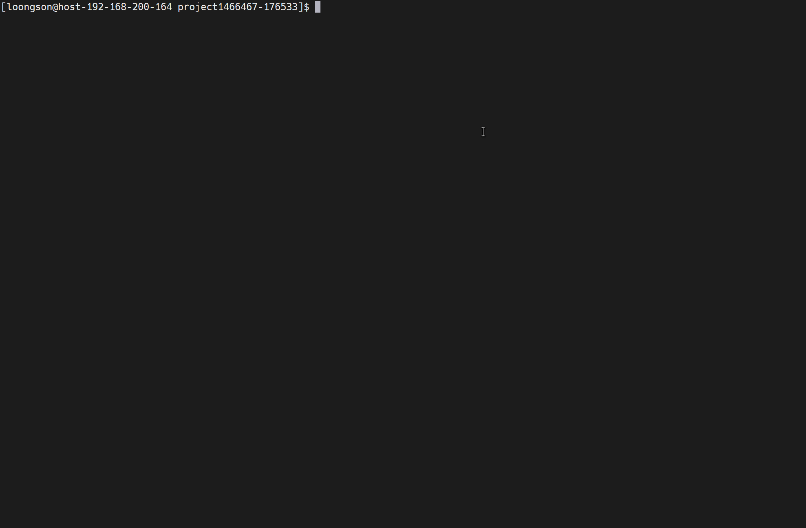

# 基于龙芯3A5000的SPMV优化

## 仓库简介

### 功能简介
在龙芯3A5000架构上实现了稀疏矩阵向量乘（SPMV）的优化。支持float、double等类型的数据。优化方法有负载均衡多线程加速以及使用龙芯向量指令集进行加速。还包含算法功能正确性以及性能测试框架。

### 仓库文件简介

```
.
├── README.md
├── accuracy   // 该文件夹保存测试SPMV计算准确性的数据文件
|              // 前缀是`matrix`的文件存储的是稀疏矩阵
|              // 前缀`vec`的文件存储的是向量
|
├── pic
│   ├── acc_usage.gif
│   └── perf_usage.gif
├── src
│   ├── double // 支持double格式的SPMV
│   │   ├── Makefile
│   │   ├── eigen.cpp  
│   │   ├── include
│   │   │   ├── env.hpp
│   │   │   ├── profiling.hpp
│   │   │   └── spmv_double.hpp
│   │   ├── spmv.cpp
│   │   ├── spmv2.cpp
│   │   ├── spmv3.cpp
│   │   ├── spmv4.cpp
│   │   ├── spmv5.cpp
│   │   └── spmv_double.S
│   └── float  // 支持float格式的SPMV
│       ├── Makefile
│       ├── eigen.cpp // 使用线性代数计算库`Eigen`进行稀疏矩阵运算
│       ├── include 
│       │   ├── env.hpp // 用于支持程序使用环境变量控制需要的逻辑
│       │   ├── profiling.hpp // 用于支持查看程序中某段代码的耗时
│       │   └── spmv_float.hpp  // 支持CSR格式的稀疏矩阵向量乘运算
│       ├── spmv.cpp  // 使用常规的基于CSR格式的SPMV运算
│       ├── spmv2.cpp  // 使用了SIMD指令的SPMV运算
│       ├── spmv3.cpp  // 单纯使用OpenMP对稀疏矩阵乘进行多线程加速
│       ├── spmv4.cpp  // 使用了负载均衡的SPMV运算
│       ├── spmv5.cpp  // 使用了负载均衡和SIMD的SPMV运算
│       └── spmv_float.S  // 使用龙芯架构的向量指令集开发的SPMV
├── test_accuracy.sh // 该脚本功能是测试开发的程序是否计算正确
└── test_performance.sh // 该脚本功能是评估算法相对原始的SPMV的加速比
```

## 测试框架介绍与使用
### 环境搭建
本项目的`eigen.cpp`使用了`Eigen`库，按照如下流程安装到计算机上，同时我们使用的机器架构为`loongarch64`。
```
wget https://gitlab.com/libeigen/eigen/-/archive/3.4.0/eigen-3.4.0.tar.gz # 下载源代码
tar -zxvf eigen-3.4.0.tar.gz #解压
cd eigen-3.4.0
mkdir build && cd build
cmake ..
sudo make install 
```

安装完成后，克隆本项目，进入`src`，如果是进行`float`类型的SPMV运算，就进入对应目录使用`make` 即可编译出相应的可执行程序。

### 评估正确性
`test_accuracy`脚本用来评估自己实现的算法的计算结果的准确性。设计思路是利用`Eigen`库计算得到的结果和自己实现的算法得到的结果作比较，如果相同则说明自己写的代码计算正确。用法为：
> bash test_accuracy.sh ${可执行程序路径}

例如为了验证原始的SPMV是否实现正确，运行此命令`bash test_accuracy.sh ./spmv`，如果计算正确，终端会打印通过信息，如果不通过，终端会打印第一次计算错误的输出向量的行索引，以及两个程序的输出结果。

{width=75%}

### 评估性能
`test_performance`脚本使用了22个不同类型的稀疏矩阵用来评估程序相比常规的基于CSR格式的SPMV算法的加速比，记录算子运行的平均时间。用法为：
> bash test_performance.sh ${可执行程序路径} ${迭代次数}

例如，运行此命令`bash test_performance.sh ./spmv4 1`，脚本会执行1次spmv和spmv4这个程序，计算原始的spmv算法执行的平均时间，计算使用了负载均衡程序的spmv4的平均时间，计算spmv4相对于spmv的加速比。

{width=75%}


## 数据集介绍
我们从[ Sparse Suite Collection](https://sparse.tamu.edu/),选择了22个具有代表性的稀疏矩阵。Sparse Suite Collection收集了大量在实际场景应用广泛的稀疏矩阵。这些矩阵集广泛用于稀疏矩阵算法的开发和性能评估，因为人工生成的矩阵会对实验产生一些误导性。 `test_performance`脚本使用的数据集下载地址点击[这里](https://pan.baidu.com/s/1xqiqJ3GySV2QYSnj4xEhYA?pwd=c57w)。数据集中的稀疏矩阵特点见下表。括号中的内容是矩阵名字的简称，用于画性能比较图，方便作为横坐标。

| 矩阵名称 | 行 x 列 | 非零元素个数 | 稀疏度 |
| --- | --- | --- | --- |
| af_shell1(**afs**) | 504855 x 504855 | 9046868 | 3.55e-05 |
| amazon0601(**ama**) | 403394 x 403394 | 3387388 | 2.08e-05 |
| as-Skitter(**ass**) | 1696415 x 1696415 | 11095298 | 3.86e-06 |
| ASIC_680k(**asi**) | 682862 x 682862 | 3871773 | 8.303e-06 |
| boneS10(**bon**) | 914898 x 914898 | 55468422 | 6.63e-05 |
| com-Youtube(**com**) | 1134890 x 1134890 | 5975248 | 4.639e-06 |
| delaunay_n19(**del**) | 524288 x 524288 | 3145646 | 1.14e-05 |
| FEM_3D_thermal2(**fem**) | 147900 x 147900 | 3489300 | 1.59e-04 |
| hugetric-00020(**hug**) | 7122792 x 7122792 | 21361554 | 4.21e-07 |
| in-2004(**in**) | 1382908 x 1382908 | 16917053 | 8.846e-06 |
| ldoor(**ldr**) | 952203 x 952203 | 23737339 | 2.62e-05 |
| mc2depi(**mc**) | 525825 x 525825 | 2100225 | 7.59e-06 |
| memchip(**mem**) | 2707524 x 2707524 | 14810202 | 2.02e-06 |
| parabolic_fem(**par**) | 525825 x 525825 | 3674625 | 1.33e-05 |
| pkustk14(**pku**) | 151926 x 151926 | 14836504 | 6.428e-04 |
| poisson3Db(**poi**) | 85623 x 85623 | 2374949 | 3.24e-04 |
| rajat31(**raj**) | 4690002 x 4690002 | 20316253 | 9.24e-07 |
| roadNet-TX(**roa**) | 1393383 x 1393383 | 3843320 | 1.98e-06 |
| sx-stackoverflow(**sxs**) | 2601977 x 2601977 | 36233450 | 5.352e-06 |
| thermomech_dK(**the**) | 204316 x 204316 | 2846228 | 6.81e-05 |
| web-Google(**wbg**) | 916428 x 916428 | 5105039 | 6.08e-06 |
| webbase-1M(**wbs**) | 1000005 x 1000005 | 3105536 | 3.106e-06 |

